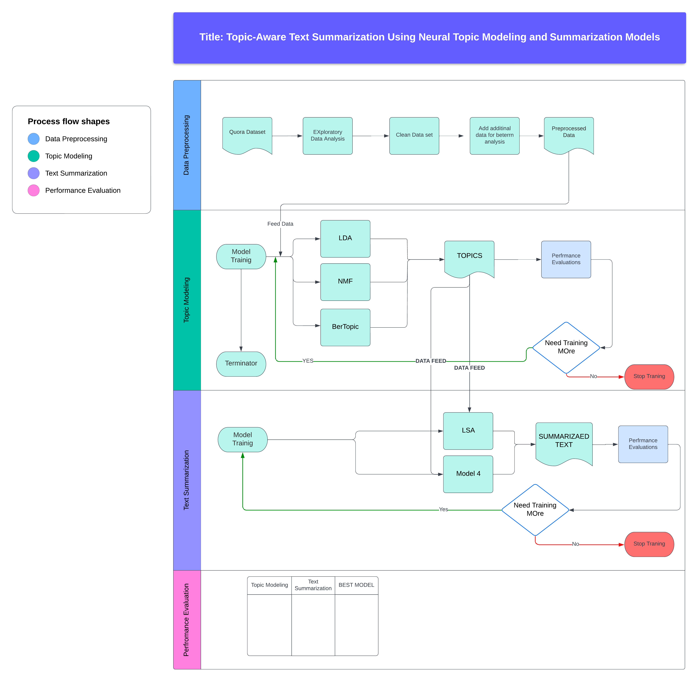

# Title: Topic-Aware Text Summarization Using Neural Topic Modeling and Summarization Models

---

## 1. Motivation

Why do we need text summarization in the new world where data is exponentially growing? It’s estimated that 2.5 quintillion bytes of data are created each day, which presents a challenge to efficiently study any given text corpus and extract knowledge from it. This is especially important in academic and research areas where time is limited, but data loss cannot be compromised. Summarizing the text makes it more helpful to subdivide the corpus into sections or individual topics because a summary may overly focus on a single topic, leading to the loss of crucial information in subsections of the text. This study/project aims to solve this problem.

---

## 2. Significance

The two-model approach allows each model to specialize. Topic modeling identifies key themes, while summarization focuses on condensing content based on those themes. This ensures more focused and relevant summaries. Additionally, it offers more modularity and flexibility, enabling fine-tuning or swapping of models independently, thereby improving performance and interpretability. In the field of Natural Language Processing (NLP), generating summaries that retain key essence elements enhances information retrieval and improves user understanding. This project can have implications for various sectors, such as academia (research paper summarization) and business (summarizing customer reviews by product aspects).

---

## 3. Objectives

In this project, we will focus on building a two-phase model. In the first phase, we will train the model to extract topics, and in the second phase, the model will focus on text summarization. Specifically, we aim to:

- Implement a topic modeling system (LDA, NMF, BERT) to extract key topics from a corpus.
- Fine-tune a pretrained text summarization model (LSA, T5) to condition its output on the identified topics.
- Evaluate the quality of the summaries in terms of topic coherence and information relevance.

---

## 4. Features

- **Neural Topic Modeling**: The first stage of the pipeline will involve discovering topics from a large corpus using neural topic models like LDA and NMF, as well as more advanced models like transformers (BERT).
- **Summarization Model**: We will use a text summarization model (such as LSA, T5, or BART) to generate summaries. The model will be fine-tuned to focus on the most important topics identified by the topic modeling stage.
- **Topic-Coherence Metric**: A custom loss function or post-processing step will be implemented to evaluate how well the summary captures the primary topics of the document.
- **Evaluation**: We will use standard NLP evaluation metrics such as ROUGE and BLEU to assess the quality of the summaries, while also incorporating topic-coherence metrics to gauge relevance.

---

## 5. Dataset
https://www.udemy.com/course/nlp-natural-language-processing-with-python/
For this project, we will use the **Quora Questions dataset** provided in the project ideas file, which contains questions on a variety of topics. This dataset is suitable for extractive and abstractive summarization tasks and will help in training and evaluating the performance of our model. Additional datasets such as the Amazon Product Reviews dataset may be used for experiments with topic-specific summarization in the review domain.

- **Size**: The Quora Questions dataset contains over 400,000 questions.
- **Type**: The dataset consists of human-written questions on various topics, making it an ideal choice for both topic modeling and summarization.
- **Preprocessing**: Before analysis, the text will be cleaned by removing unnecessary characters, and tokenization will be applied. For topic modeling, we will also experiment with stop-word removal and lemmatization to improve the quality of the topics extracted.

---

https://www.udemy.com/course/nlp-natural-language-processing-with-python/